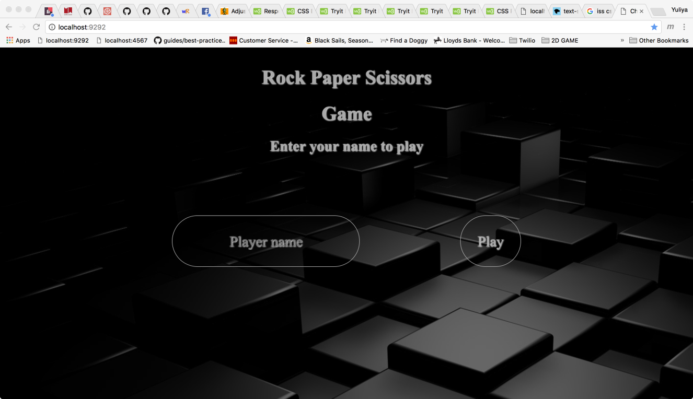
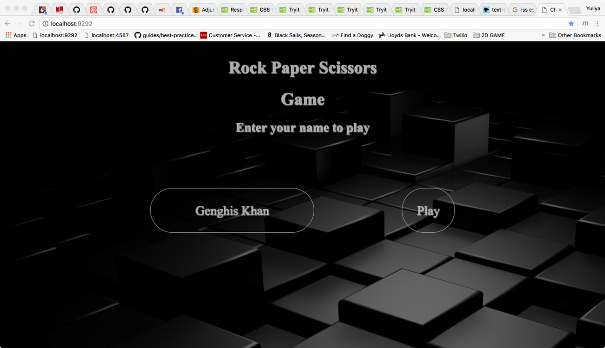

# RPS Challenge

Before starting the app run 
`bundle install`
to make sure all dependencies are available.

To start the app run 
`rackup`
from the command line, from within the directory of the app.

This app runs only on localhost. Sinatra will start up a server on port 9292.

### Functionality

- the player can enter their name before the game
- the player is presented the choices (rock, paper and scissors)
- the player can choose one option
- the game can choose a random option
- a winner is declared

### Basic Rules

- Rock beats Scissors
- Scissors beats Paper
- Paper beats Rock

### Technology used
- RSpec
- Ruby-Enum gem

